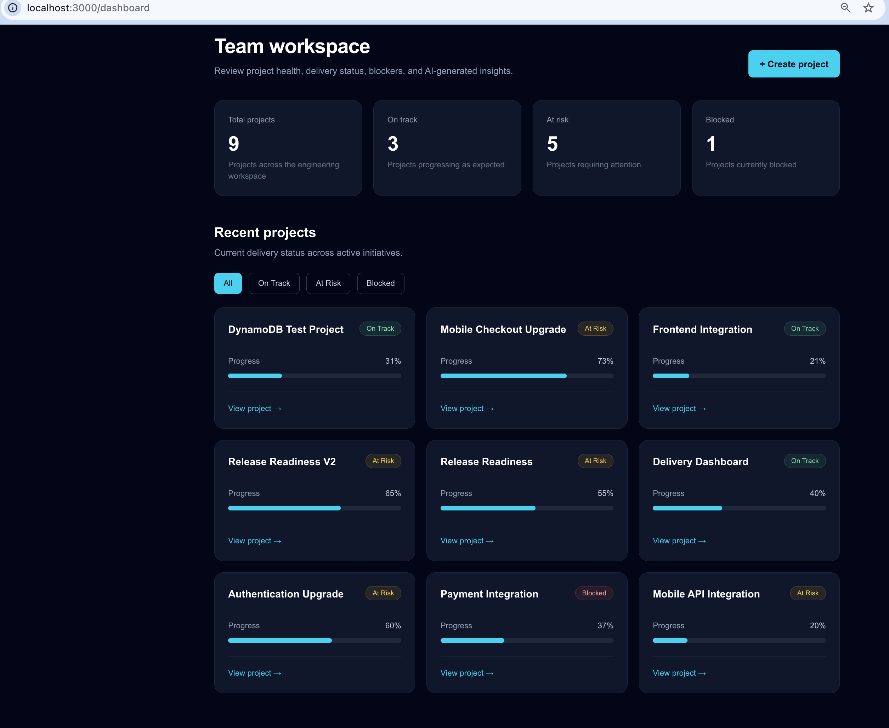
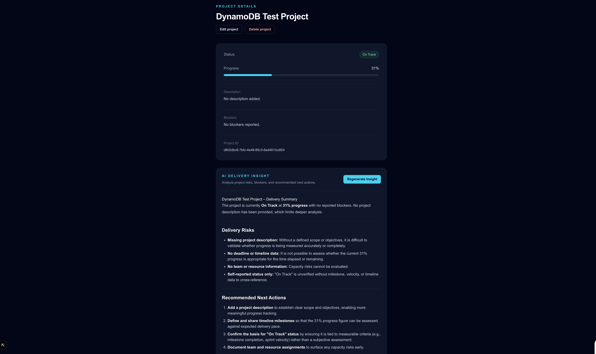
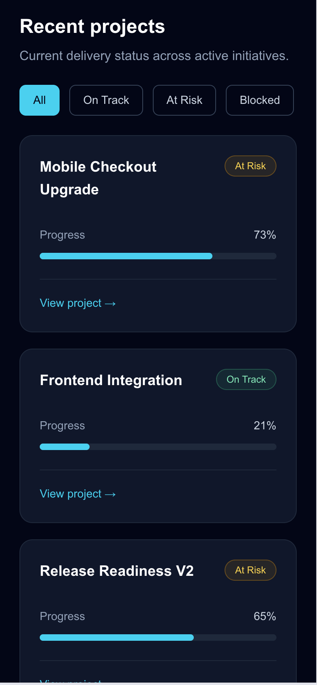
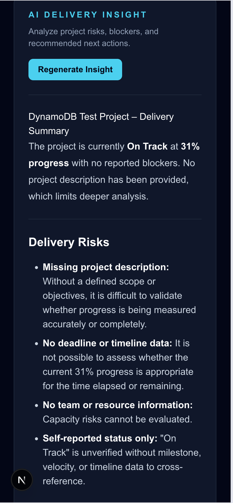

# Engineering Delivery Hub

Engineering Delivery Hub is a full-stack web and mobile application for tracking engineering initiatives, monitoring delivery health, identifying blockers, and generating AI-powered project insights.

Built with Next.js, React Native, Expo, TypeScript, and AWS serverless services, the application combines project management, secure authentication, protected APIs, cloud persistence, and generative AI in an end-to-end architecture.

## Overview

Engineering Delivery Hub provides authenticated users with a centralized experience for managing engineering projects and understanding delivery health across web and mobile clients.

Users can create and manage projects, track status and progress, document blockers, and generate AI-assisted delivery insights that highlight risks and recommend next actions.

The project demonstrates:

- Web application development with Next.js
- Cross-platform mobile development with React Native and Expo
- OAuth 2.0 Authorization Code Flow with PKCE
- Secure web and mobile token handling
- Protected AWS APIs
- Serverless backend architecture
- DynamoDB persistence
- Generative AI integration with Amazon Bedrock
- Infrastructure as Code using AWS SAM

## Application Preview

### Web Dashboard



### Project Delivery & AI Insights



### Responsive Project View

<p align="center">
  
  &nbsp;&nbsp;
  
</p>

## Key Features

- Create, view, update, and delete engineering projects
- Track project status and completion progress
- Capture project descriptions and blockers
- Authenticate users with Amazon Cognito
- Support separate web and mobile Cognito application clients
- Protect application routes and backend APIs
- Securely store mobile authentication tokens using Expo SecureStore
- Restore authenticated mobile sessions on application launch
- Sign out and clear mobile authentication state
- Automatically refresh expired access tokens
- Retry protected API requests once after token renewal
- Retrieve real project data from DynamoDB
- View individual project details
- Generate AI-powered delivery summaries
- Identify project risks and blockers
- Generate recommended next actions
- View the application architecture
- Deploy backend infrastructure using AWS SAM

## Architecture

Engineering Delivery Hub supports both a Next.js web application and a React Native / Expo mobile application.

The web application uses Next.js Route Handlers as a Backend for Frontend (BFF), while the mobile application communicates directly with the protected AWS API.

```text
                         Amazon Cognito
                    Authentication / OAuth 2.0
                         /             \
                        /               \
                       v                 v
              Next.js Web App     React Native / Expo
                     |                   |
                     |                   |
              Next.js Route             |
                Handlers                |
                  (BFF)                  |
                     |                   |
                     +---------+---------+
                               |
                               | Bearer Access Token
                               v
                       Amazon API Gateway
                               |
                         JWT Authorizer
                               |
                               v
                           AWS Lambda
                          /          \
                         v            v
                   DynamoDB      Amazon Bedrock
                                       |
                                       v
                               Claude Sonnet 4.6
```

Amazon Cognito handles authentication and token issuance for both applications.

The web application forwards protected requests through Next.js Route Handlers.

The React Native mobile application retrieves the Cognito access token from secure device storage and sends protected requests directly to API Gateway.

API Gateway validates JWT access tokens before routing authorized requests to Lambda.

Lambda functions implement backend application logic, using DynamoDB for project persistence and Amazon Bedrock for AI-powered delivery analysis.

A dedicated `/architecture` page in the web application provides an in-app view of the system design.

## Tech Stack

### Web

- Next.js 16
- React 19
- TypeScript
- Tailwind CSS
- Next.js App Router
- Server and Client Components
- Next.js Route Handlers
- Backend for Frontend pattern

### Mobile

- React Native
- Expo
- TypeScript
- Expo Router
- Expo AuthSession
- Expo SecureStore
- Expo Linking
- React Native Safe Area Context
- OAuth 2.0 Authorization Code Flow with PKCE

### Backend

- Node.js
- TypeScript
- AWS Lambda
- REST-style APIs

### AWS

- Amazon Cognito
- Amazon API Gateway
- AWS Lambda
- Amazon DynamoDB
- Amazon Bedrock
- AWS IAM
- AWS SAM
- AWS CloudFormation

### Generative AI

- Amazon Bedrock
- Anthropic Claude Sonnet 4.6
- Prompt-based project delivery analysis

## Authentication & Security

Authentication is implemented with Amazon Cognito using OAuth 2.0 authorization-code-based authentication.

The web and mobile applications use separate Cognito application clients appropriate to their execution environments.

### Web Authentication

The Next.js application uses a server-oriented authentication model.

Authentication tokens are stored in HttpOnly cookies, keeping them inaccessible to normal client-side JavaScript.

Next.js Route Handlers provide a BFF layer for interactive browser operations and securely forward access tokens to the AWS backend.

```text
Browser
   |
   v
Next.js BFF
   |
   | Authorization: Bearer <access_token>
   v
API Gateway
   |
   | JWT validation
   v
Lambda
```

### Mobile Authentication

The React Native application uses the OAuth 2.0 Authorization Code Flow with PKCE.

PKCE allows a public mobile client to authenticate without embedding a client secret inside the application.

```text
React Native App
       |
       v
Amazon Cognito
       |
Authorization Code + PKCE
       |
       v
Access / ID / Refresh Tokens
       |
       v
Expo SecureStore
```

The mobile application:

- Opens the Cognito hosted sign-in flow
- Uses PKCE during authorization-code exchange
- Stores access, ID, and refresh tokens using Expo SecureStore
- Restores authentication state when the application launches
- Protects authenticated application routes
- Clears stored authentication tokens during sign-out
- Sends the access token to API Gateway as a Bearer token

Protected mobile API requests follow this flow:

```text
React Native / Expo
       |
       | Authorization: Bearer <access_token>
       v
API Gateway
       |
       | JWT validation
       v
Lambda
       |
       v
DynamoDB / Bedrock
```

The API Gateway JWT authorizer accepts tokens issued for both the web and mobile Cognito application clients.

## Access Token Refresh

Both application clients support access-token renewal.

For the mobile application, protected requests are centralized through a reusable authenticated fetch layer.

```text
Protected API Request
        |
        v
   Access Token
        |
        v
    API Gateway
        |
        v
   401 Unauthorized?
      /        \
    No          Yes
    |            |
    v            v
Return       Refresh Token
Response          |
                  v
             Amazon Cognito
                  |
                  v
           New Access Token
                  |
                  v
             SecureStore
                  |
                  v
          Retry Request Once
```

This keeps token-refresh behavior outside individual project API functions and avoids duplicating authentication logic across requests.

## Mobile API Integration

The mobile application consumes the same AWS backend as the web application.

Available mobile functionality includes:

```text
Projects Screen
      |
      v
GET /projects
      |
      v
DynamoDB Projects
      |
      v
Tap Project
      |
      v
GET /projects/{id}
      |
      v
Project Details
      |
      v
Generate AI Insight
      |
      v
POST /projects/{id}/summary
      |
      v
Amazon Bedrock
```

The mobile application currently displays:

- Project name
- Delivery status
- Progress
- Description
- Blockers
- Project ID
- AI-generated delivery insight

## AI Integration

Engineering Delivery Hub uses Amazon Bedrock with Anthropic Claude Sonnet 4.6 to analyze project delivery information.

When a user selects **Generate AI Insight**, project context such as status, progress, description, and blockers is sent through the secured backend for analysis.

The generated insight can include:

- Delivery summary
- Key delivery risks
- Recommended next actions
- Identification of missing information that may affect the delivery assessment

### Web

```text
Generate AI Insight
        |
        v
Next.js BFF
        |
        v
API Gateway
        |
        v
Lambda
        |
        +----> DynamoDB
        |
        v
Amazon Bedrock
        |
        v
Claude Sonnet 4.6
        |
        v
Delivery Insight
```

### Mobile

```text
Generate AI Insight
        |
        v
Authenticated Fetch
        |
        v
API Gateway
        |
        v
Lambda
        |
        +----> DynamoDB
        |
        v
Amazon Bedrock
        |
        v
Claude Sonnet 4.6
        |
        v
React Native UI
```

AI generation is performed on demand rather than during every project request, helping limit unnecessary model invocations.

## API Endpoints

| Method   | Endpoint                 | Description                     |
| -------- | ------------------------ | ------------------------------- |
| `GET`    | `/projects`              | Retrieve all projects           |
| `GET`    | `/projects/{id}`         | Retrieve a project              |
| `POST`   | `/projects`              | Create a project                |
| `PUT`    | `/projects/{id}`         | Update a project                |
| `DELETE` | `/projects/{id}`         | Delete a project                |
| `POST`   | `/projects/{id}/summary` | Generate an AI delivery insight |

Project endpoints are protected by the API Gateway JWT authorizer.

## Project Structure

```text
engineering-delivery-hub/
│
├── web/
│   ├── src/
│   │   ├── app/
│   │   │   ├── api/
│   │   │   │   ├── auth/
│   │   │   │   └── projects/
│   │   │   ├── architecture/
│   │   │   └── dashboard/
│   │   ├── components/
│   │   ├── lib/
│   │   └── types/
│   └── package.json
│
├── mobile/
│   ├── app/
│   │   ├── _layout.tsx
│   │   ├── index.tsx
│   │   ├── sign-in.tsx
│   │   └── projects/
│   │       └── [id].tsx
│   ├── src/
│   │   ├── api/
│   │   │   └── projects.ts
│   │   │
│   │   │── auth/
│   │   ├── AuthContext.tsx
│   │   └── authFetch.ts
│   ├── assets/
│   ├── app.json
│   └── package.json
│
├── backend/
│   ├── src/
│   │   ├── handlers/
│   │   └── services/
│   ├── template.yaml
│   └── package.json
│
└── README.md
```

The `web` directory contains the Next.js frontend and BFF routes.

The `mobile` directory contains the Expo / React Native application, Cognito authentication flow, secure session management, authenticated API layer, project screens, and AI integration.

The `backend` directory contains Lambda handlers, backend services, and the AWS SAM infrastructure definition.

## Running Locally

### Web

```bash
cd web
npm install
npm run dev
```

The web application runs locally at:

```text
http://localhost:3000
```

Web validation:

```bash
npx tsc --noEmit
npm run lint
npm run build
```

### Mobile

```bash
cd mobile
npm install
npx expo start
```

Required mobile environment configuration includes:

```text
EXPO_PUBLIC_API_BASE_URL
EXPO_PUBLIC_COGNITO_CLIENT_ID
EXPO_PUBLIC_COGNITO_DOMAIN
EXPO_PUBLIC_COGNITO_REDIRECT_URI
```

Actual environment values and credentials should not be committed to source control.

Mobile validation:

```bash
npx tsc --noEmit
npx expo-doctor
```

### Backend

```bash
cd backend
npm install
sam validate --lint
sam build
```

Deployments are managed through AWS SAM and CloudFormation.

Local AWS and Cognito configuration must be provided through the appropriate environment configuration.

Secrets and other sensitive configuration values should never be committed to source control.

## Security Considerations

Security controls include:

- Amazon Cognito authentication
- Separate web and mobile Cognito application clients
- OAuth 2.0 Authorization Code Flow with PKCE for mobile
- HttpOnly authentication cookies for web
- Expo SecureStore for mobile authentication tokens
- API Gateway JWT authorization
- Protected backend endpoints
- Server-side token forwarding for web requests
- Bearer-token authorization for mobile requests
- Refresh-token handling
- Single-retry behavior after access-token renewal
- Least-privilege IAM permissions
- Restricted Bedrock invocation permissions
- Authorization configuration managed through Infrastructure as Code
- Environment configuration excluded from source control

## Validation

The mobile application is validated with:

```bash
npx tsc --noEmit
npx expo-doctor
```

Current Expo validation:

```text
21/21 checks passed
No issues detected
```

The backend infrastructure is validated and built using AWS SAM before deployment.

## Future Improvements

Potential next steps include:

- Automated unit and integration testing
- CI/CD pipeline
- Production web deployment
- Mobile release builds for iOS and Android
- App Store and Google Play deployment
- Enhanced CloudWatch logging and observability
- Structured AI responses with schema validation
- AI insight persistence and caching
- API rate limiting
- Role-based authorization
- Per-user or per-team project ownership
- Enhanced token refresh for server-rendered web requests
- AI usage and cost monitoring
- Prompt versioning
- Offline-aware mobile data handling
- Mobile push notifications
